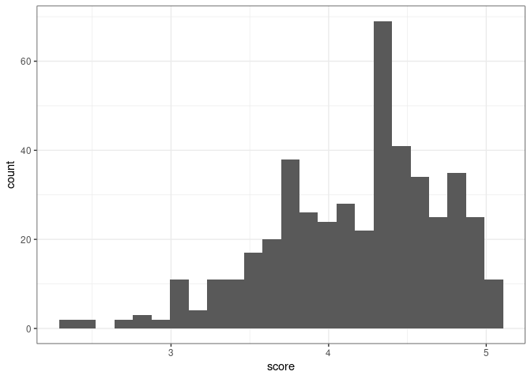

Activity 4 - Day 1
================

## Libraries

``` r
library(tidyverse)
library(tidymodels)
library(GGally)
```

## Load Data

``` r
evals <- readr::read_tsv("https://www.openintro.org/data/tab-delimited/evals.txt")
```

### The Data

``` r
evals %>% 
  ggplot(aes(x=score)) + 
  geom_histogram(bins = 24) + 
  theme_bw()
```

<!-- --> The
distribution of score appears to be left skewed.
