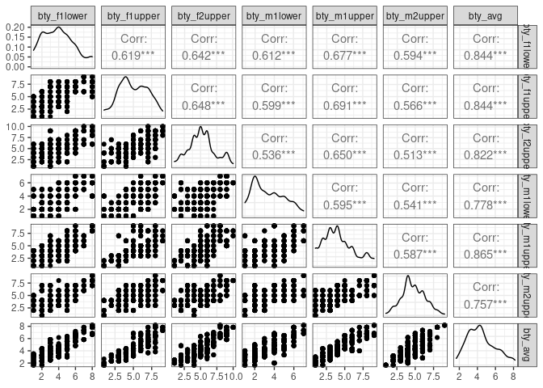

Activity 4 - Day 1
================

## Libraries

``` r
library(tidyverse)
library(tidymodels)
library(GGally)
```

## Load Data

``` r
evals <- readr::read_tsv("https://www.openintro.org/data/tab-delimited/evals.txt")
```

### The Data

``` r
evals %>% 
  ggplot(aes(x=score)) + 
  geom_histogram(bins = 24) + 
  theme_bw()
```

<!-- -->

The distribution of score appears to be left skewed.

``` r
evals %>% 
  ggplot(aes(x=age,y=bty_avg)) + 
  geom_point() + 
  theme_bw()
```

<!-- -->

There does not appear to be a strong relation between `bty_avg` and
`age`. There may be a weak negative relationship.

## Pairwise Relationships

``` r
evals %>% 
  select(starts_with("bty_")) %>% 
  ggpairs() +
  theme_bw()
```

<!-- --> The relationship
between all of these variables appear to be positive. `bty_m1low` seems
to have the weakest correlations with the 3 variables starting with
`bty_f`. It does not make sense to include all of these beauty variables
in our model.

### MLR: One Quantitative predictor and One Qualitative Predictor

``` r
m_bty_gen <- lm(score ~ bty_avg + gender, data = evals)
tidy(m_bty_gen)
```

    ## # A tibble: 3 × 5
    ##   term        estimate std.error statistic   p.value
    ##   <chr>          <dbl>     <dbl>     <dbl>     <dbl>
    ## 1 (Intercept)   3.75      0.0847     44.3  6.23e-168
    ## 2 bty_avg       0.0742    0.0163      4.56 6.48e-  6
    ## 3 gendermale    0.172     0.0502      3.43 6.52e-  4

The predictor `bty_avg` is a significant in explaining the variance in
score. The inclusion of the variable `gender` increase the parameter
estimate for `bty_avg`.

The formula for male professors is 3.747 + .074`bty_avg` + 0.172

Therefore, if two professors have the same beauty rating, the male
professor will have a score that is 0.172 higher than the female.

``` r
m_bty_rank <- lm(score ~ bty_avg + rank, data = evals)
tidy(m_bty_rank)
```

    ## # A tibble: 4 × 5
    ##   term             estimate std.error statistic   p.value
    ##   <chr>               <dbl>     <dbl>     <dbl>     <dbl>
    ## 1 (Intercept)        3.98      0.0908     43.9  2.92e-166
    ## 2 bty_avg            0.0678    0.0165      4.10 4.92e-  5
    ## 3 ranktenure track  -0.161     0.0740     -2.17 3.03e-  2
    ## 4 ranktenured       -0.126     0.0627     -2.01 4.45e-  2

## Day 2 - Interaction Terms and Other Considerations

### bty\_avg x gender interaction

``` r
m_int <- lm(score ~ bty_avg * gender, data = evals)
tidy(m_int)
```

    ## # A tibble: 4 × 5
    ##   term               estimate std.error statistic   p.value
    ##   <chr>                 <dbl>     <dbl>     <dbl>     <dbl>
    ## 1 (Intercept)          3.95      0.118      33.5  2.92e-125
    ## 2 bty_avg              0.0306    0.0240      1.28 2.02e-  1
    ## 3 gendermale          -0.184     0.153      -1.20 2.32e-  1
    ## 4 bty_avg:gendermale   0.0796    0.0325      2.45 1.46e-  2

`bty_avg:gendermale` means that this variable is the interaction between
`bty_avg` and if the professor was male.

The interaction equation would be `score` = 3.95 + (0.031 + 0.079 \*
`gendermale`) \* `bty_avg` - 0.184 `gendermale` or for male professors
`score` = 3.76 + 1.1 \* `bty_avg` and for female professors `score` =
3.95 + 0.031 \* `bty_avg`

For two professors of different genders have the same beauty scores, the
male counterpart will have the higher score.

``` r
summary(m_int)
```

    ## 
    ## Call:
    ## lm(formula = score ~ bty_avg * gender, data = evals)
    ## 
    ## Residuals:
    ##     Min      1Q  Median      3Q     Max 
    ## -1.8084 -0.3828  0.0903  0.4037  0.9211 
    ## 
    ## Coefficients:
    ##                    Estimate Std. Error t value Pr(>|t|)    
    ## (Intercept)         3.95006    0.11800  33.475   <2e-16 ***
    ## bty_avg             0.03064    0.02400   1.277   0.2024    
    ## gendermale         -0.18351    0.15349  -1.196   0.2325    
    ## bty_avg:gendermale  0.07962    0.03247   2.452   0.0146 *  
    ## ---
    ## Signif. codes:  0 '***' 0.001 '**' 0.01 '*' 0.05 '.' 0.1 ' ' 1
    ## 
    ## Residual standard error: 0.5258 on 459 degrees of freedom
    ## Multiple R-squared:  0.07129,    Adjusted R-squared:  0.06522 
    ## F-statistic: 11.74 on 3 and 459 DF,  p-value: 1.997e-07

``` r
summary(m_bty_gen)
```

    ## 
    ## Call:
    ## lm(formula = score ~ bty_avg + gender, data = evals)
    ## 
    ## Residuals:
    ##     Min      1Q  Median      3Q     Max 
    ## -1.8305 -0.3625  0.1055  0.4213  0.9314 
    ## 
    ## Coefficients:
    ##             Estimate Std. Error t value Pr(>|t|)    
    ## (Intercept)  3.74734    0.08466  44.266  < 2e-16 ***
    ## bty_avg      0.07416    0.01625   4.563 6.48e-06 ***
    ## gendermale   0.17239    0.05022   3.433 0.000652 ***
    ## ---
    ## Signif. codes:  0 '***' 0.001 '**' 0.01 '*' 0.05 '.' 0.1 ' ' 1
    ## 
    ## Residual standard error: 0.5287 on 460 degrees of freedom
    ## Multiple R-squared:  0.05912,    Adjusted R-squared:  0.05503 
    ## F-statistic: 14.45 on 2 and 460 DF,  p-value: 8.177e-07

The r-squared value for `m_int` is 0.0712 and `m_bty_gen` is 0.0591, so
`m_int` is a better model for explaining the variation in `score`.

### bty\_avg x ranking interaction

``` r
m_int_rank <- lm(score ~ bty_avg * rank, data = evals)
tidy(m_int_rank)
```

    ## # A tibble: 6 × 5
    ##   term                     estimate std.error statistic  p.value
    ##   <chr>                       <dbl>     <dbl>     <dbl>    <dbl>
    ## 1 (Intercept)                4.10      0.150    27.4    1.80e-98
    ## 2 bty_avg                    0.0417    0.0314    1.33   1.84e- 1
    ## 3 ranktenure track          -0.0188    0.230    -0.0818 9.35e- 1
    ## 4 ranktenured               -0.409     0.182    -2.25   2.52e- 2
    ## 5 bty_avg:ranktenure track  -0.0264    0.0463   -0.570  5.69e- 1
    ## 6 bty_avg:ranktenured        0.0659    0.0392    1.68   9.38e- 2

The interaction equation would be `score` = 4.098 + (0.041 - (0.026 \*
`ranktenure_track`) + (0.065 \* `ranktenured`)) \* `bty_avg` - 0.018 \*
`ranktenure_track` - 0.409 \* `ranktenured`
